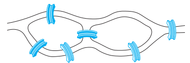

### Section 10.5 Eular and Hamilton Paths
p725: 10, 26, 28a, 30, 31, 35

10\. Can someone cross all the bridges shown in this map exactly once and return to the starting point?

26\. For which values of n do these graphs have an Euler circuit?
a) $K_n$   b) $C_n$   c) $W_n$   d) $Q_n$

28\. For which values of m and n does the complete bipartite graph $K_{m,n} have an Euler Path?

In Exercises 30–36 determine whether the given graph has a Hamilton circuit. If it does, find such a circuit. If it does not, give an argument to show why no such circuit exists.

30\. 

31\. 
