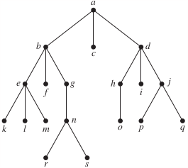

### Section 11.3 Tree Traversal
p804: 8, 9

In Exercises 7–9 determine the order in which a _preorder_ traversal visits the vertices of the given ordered rooted tree.
8\. 
>Solution
a, b, d, e, i, i, m, n, o, c, f, g, h, k, l, p

9\. 
>Solution
a, b, e, k, l, m, f, g, n, r, s, c, d, h, o, i, j, p, q
