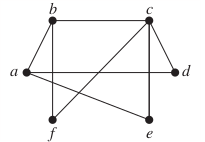
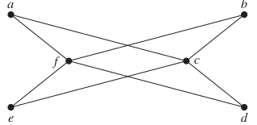
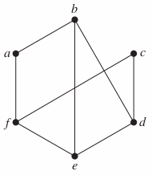

### 10.2 Graph Terminology
p672

#### Homework
p687: 23, 24, 25, 52, 53, 54

In Exercises 21–25 determine whether the graph is bipartite. You may find it useful to apply **Theorem 4** and answer the question by determining whether it is possible to assign either red or blue to each vertex so that no two adjacent vertices are assigned the same color.
23\. 
>Solution
Not bipartite.

24\. 
>Solution
Bipartite

25\. 
>Solution
Not bipartite.

52\. Let **G** be a graph with **v** vertices and **e** edges. Let **M** be the maximum degree of the vertices of **G**, and let **m** be the minimum degree of the vertices of **G**. Show that
a) $2e/v \geq m$ &emsp; b) $2e/v \leq M$.
>Solution
Let the $i$th vertex be $v_i$, and the degree of $v_i$ be $m_i$.
$$
\begin{aligned}
m &\leq m_i\leq M\\
\underbrace{m + m + \cdots + m}_{v \text{ times}} &\leq m_1 + m_2 + \cdots +m_i+ \cdots + m_v \leq \underbrace{M + M + \cdots + M}_{v \text{ times}}\\
vm &\leq \sum_{i\in v}{deg(v_i)} \leq vM\\
vm &\leq 2e \leq vM \quad \text{The handshaking theorem}\\
m &\leq \frac{2e}{v} \leq M \quad \text{a and b are proved.}
\end{aligned}
$$

A simple graph is called regular if every vertex of this graph has the same degree. A regular graph is called **n**-regular if every vertex in this graph has degree **n**.
53\. For which values of **n** are these graphs regular?
a) $K_n$ &emsp; b) $C_n$ &emsp; c) $W_n$ &emsp; d) $Q_n$
>Solution
a. For $n\geq 1$, $K_n$ is a **(n-1)**-regular graph.
b. For $n\geq 3$, $C_n$ is a **2**-regular graph.
c. For $n=3$, $W_n$ is a **3**-regular graph.
d. For $n \geq 0$, $W_n$ is a **n**-regular graph.

54\. For which values of **m** and **n** is **$K_{m,n}$** regular?
>Solution
When $m=n$, $K_{m,n}$ is regular.

64\. Show that if $G$ is a bipartite simple graph with $v$ vertices and $e$ edges, then $e \les \frac{v^2}{4}$.
>Solution
