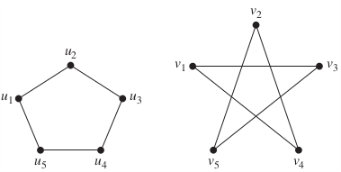
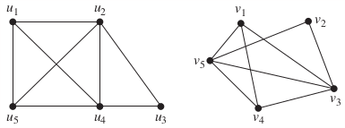
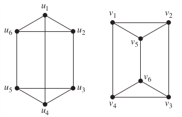

### 10.3 Representing Graphs and Graph Isomorphism
Todo

#### Homework
p697: 35, 36, 37, 38, 39

In Exercises 34–44 determine whether the given pair of graphs is isomorphic. Exhibit an isomorphism or provide a rigorous argument that none exists.

35\. 
>Solution

36\. 

37\. 

38\. 

39\. 
