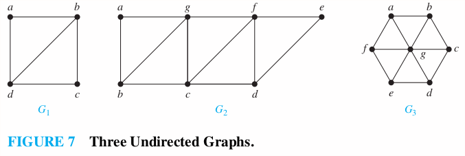
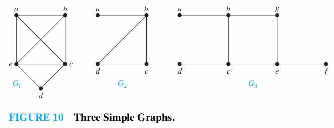

### 10.5 Euler and Hamilton Paths
p714
Ex: 1-7

#### Euler Paths and Circuits
An **Euler circuit** in a graph $G$ is a simple circuit containing every edge of $G$. An **Euler path** in $G$ is a simple path containing every edge of $G$.

>Theorem 1
A connected multigraph with at least two vertices has an Euler circuit if and only if each of its vertices has even degree.

>Theorem 2
A connected multigraph has an Euler path but not an Euler circuit if and only if it has exactly two vertices of odd edges.

Example 4
Which graphs shown in Figure 7 have an Euler path?

>Solution
1\. $G_1$ contains exactly two vertices $(b, d)$ of odd degree. Hence it has an Euler path that must have $b$ and $d$ as its end points. One such Euler Path is $d, a, b, c, d, b$.
2\. $G_2$ contains exactly two vertices $(b, d)$ of odd degree. One such Euler Path is $b, a, g, f, e, d, c, b, g, c, f, d$.
3\. $G_3$ has no Euler path as it has six vertices of odd degree.

#### Hamilton Paths and Circuits
A simple path in a graph $G$ that passes through every vertex exactly once is called a **Hamilton path**, and a simple circuit in a graph $G$ that passes through every vertex exactly once is called a **Hamilton circuit**. That is, the simple path $x_0, x_1, x_2, \cdots , x_{n-1}, x_n$ in the graph $G = (V , E)$ is a Hamilton path if $V = \{x_0, x_1, x_2, \cdots , x_{n-1}, x_n\}$ and $x_i = x_j$ for $0 \les i \le j \les n$, and the simple circuit $x_0, x_1, x_2, \cdots , x_{n-1}, x_n, x_0$ (with $n > 0$) is a Hamilton circuit if $x_0, x_1, x_2, \cdots , x_{n-1}, x_n$ is a Hamilton path.

Example 5
Which of the simple graphs in Figure 10 have a Hamilton circuit or, if not, a Hamilton path?

>Solution
1\. $G_1$ has a Hamilton circuit: $a, b, c, d, e$
2\. There is no Hamilton circuit in $G_2$. But $G_2$ does have a Hamilton path: $a, b, c, d$.
3\. $G_3$ has neither a Hamilton circult nor Hamilton path.

#### Homework
p725: 10, 26, 28a, 30, 31, 35

10\. Can someone cross all the bridges shown in this map exactly once and return to the starting point?

>Solution
Todo

26\. For which values of n do these graphs have an Euler circuit?
a) $K_n$ &emsp; b) $C_n$ &emsp; c) $W_n$ &emsp; d) $Q_n$
>Solution
a. Every vertex in $K_n$ has degree $n-1$. $K_n$ has an Euler circuit if $n$ is odd.
b. Every vertex in $C_n$ has degree $2$. $C_n$ has an Euler circuit for every $n$.
c. Every vertex except the center of $W_n$ has degree $3$. $W_n$ has an Euler circuit for no $n$.
d. Every vertex in $Q_n$ has degree $n$. $Q_n$ has an Euler circuit if $n$ is even.

28\. For which values of m and n does the complete bipartite graph $K_{m,n}$ have an Euler Path?
>Solution
$K_{2, x}$ or $K_{x, 2}$ for all odd $x$.

In Exercises 30–36 determine whether the given graph has a Hamilton circuit. If it does, find such a circuit. If it does not, give an argument to show why no such circuit exists.
30\. 
>Solution
The graph has **no** Hamiton circuit. There is a Hamilton path $(a, b, c, f, d, e)$, $e$ and $a$ can not be connected without repeating previous edges.

31\. 
>Solution
$a, b, c, d, e, a$
