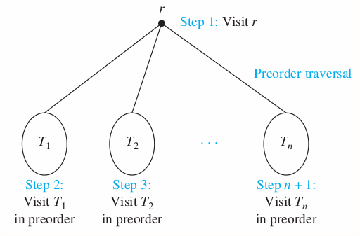
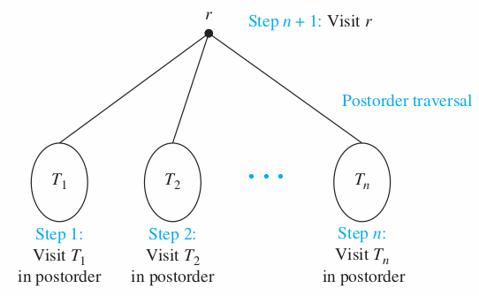
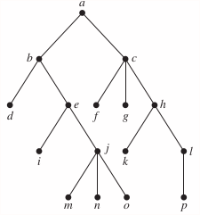

### 11.3 Tree Traversal

#### Preorder
Let $T$ be an ordered rooted tree with root $r$. It $T$ consists only of $r$, then $r$ is the _preorder trasversal_ of $T$. Otherwise, suppose that $T_1, T_2, \cdots T_n$ are the subtrees at $r$ from left to right in $T$. The _preorder trasveral_ begins by visiting $T_1$. It continues by traversing $T_1$ in preorder, then $T_2$ in preorder, and so on, until $T_n$ is traversed in preorder.
> Root => Left => Right



##### Algorithem 1 Preorder traversal
```
procedure preorder(T: ordered rooted tree)
r := root of T
list r
for each child c of r from left to right
  T(c) := subtree with c as its root
  procedure(T(c))
```

#### Inorder
Let $T$ be an ordered rooted tree with root $r$. It $T$ consists only of $r$, then $r$ is the _inorder trasversal_ of $T$. Otherwise, suppose that $T_1, T_2, \cdots T_n$ are the subtrees at $r$ from left to right in $T$. The _inorder trasveral_ begins by traversing $T_1$ in inorder, then visiting $r$. It continues by traversing $T_2$ in inorder, then $T_3$ in inorder, ..., and finally $T_n$ in order.
> Left => Root => Right


>Example

>Solution
```
b,                        a, c,    d
e,                b, f,   a, c,    g,       d, h, i
j, e, k,          b, f,   a, c,    l, g, m, d, h, i
j, e, n, k, o, p, b, f,   a, c,    l, g, m, d, h, i
```

##### Algorithem 2 Inorder traversal
```
procedure inorder(T: ordered rooted tree)
r := root of T
if r is a leaf then list r
else
  l := first child of r from left to right
  T(l) := subtree with l as its root
  inorder(T(l))
  list r
  for each child c of r except l from left to right
    T(c) := subtree with c as its root
    inorder(T(c))
```

#### Postorder
Let $T$ be an ordered rooted tree with root $r$. It $T$ consists only of $r$, then $r$ is the _postorder trasversal_ of $T$. Otherwise, suppose that $T_1, T_2, \cdots T_n$ are the subtrees at $r$ from left to right in $T$. The _postorder trasveral_ begins by traversing $T_1$ in postorder, then $T_2$ in postorder, ... then $T_n$ in postorder, and ends by visiting $r$.
> Left => Right => Root



>Example

>Solution
```
b,       c, d,          a
e, f, b, c, g, h, i, d, a
j, k, e, f, b, c, l, m, g, h, i, d, a
j, n, o, p, k, e, f, b, c, l, m, g, h, i, d, a
```

##### Algorithem 3 Postorder traversal
```
procedure postorder(T: ordered rooted tree)
r := root of T
for each child c of r from left to right
  T(c) := subtree with c as its root
  postorder(T(c))
list r
```

#### Homework
p804: 8, 9

In Exercises 7–9 determine the order in which a _preorder_ traversal visits the vertices of the given ordered rooted tree.
8\. 
>Solution
a, b, d, e, i, j, m, n, o, c, f, g, h, k, l, p

9\. 
>Solution
a, b, e, k, l, m, f, g, n, r, s, c, d, h, o, i, j, p, q
